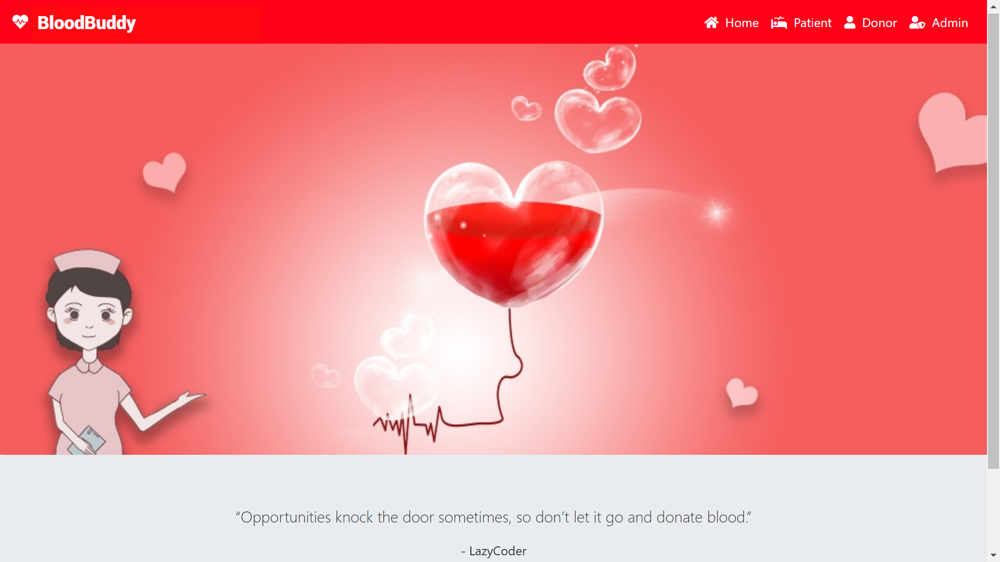
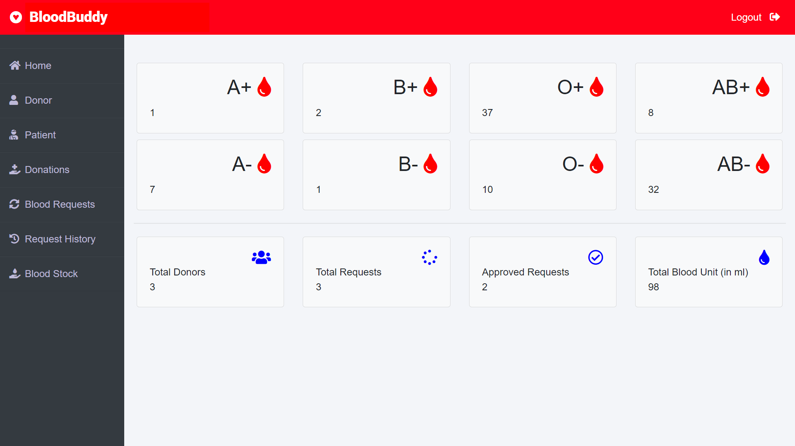
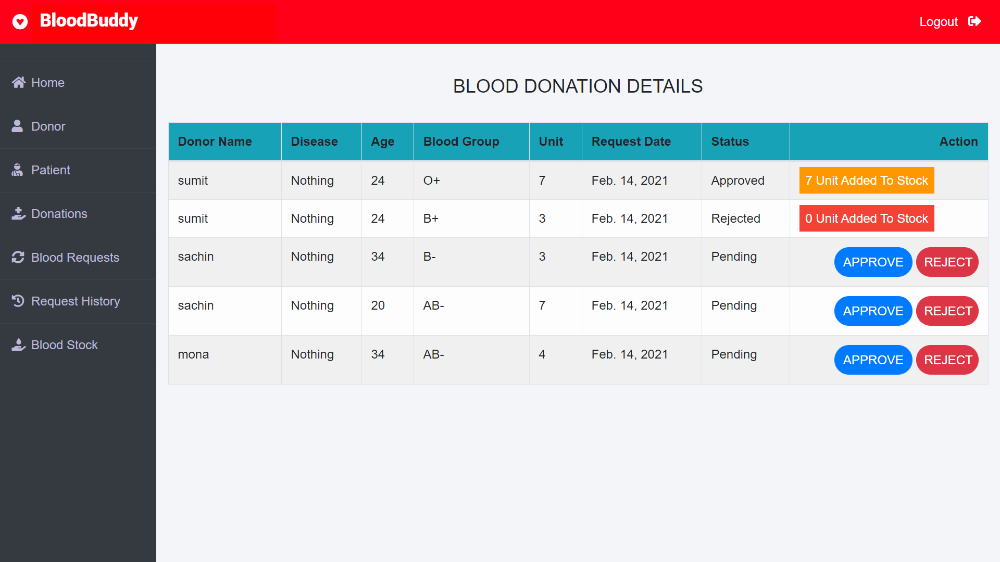
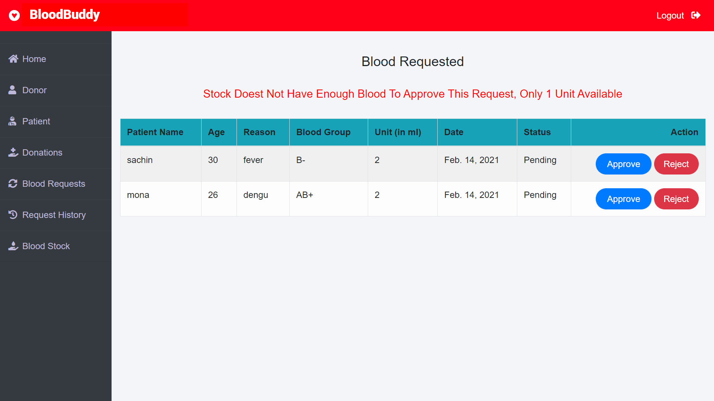
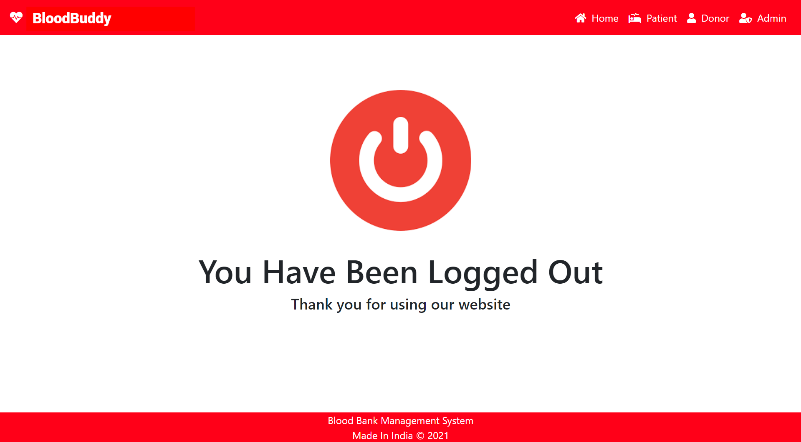

# BloodBuddy

BloodBuddy is a comprehensive web application designed to streamline the management of blood banks. By catering to the specific needs of administrators, donors, and patients, BloodBuddy ensures a smooth and efficient process for blood donations and requests. This application aims to enhance the transparency and reliability of blood bank operations, ultimately contributing to saving lives by maintaining an adequate and readily available blood supply.

BloodBuddy addresses the challenges faced by traditional blood bank management systems, which often involve manual processes and lack real-time data tracking. The application offers a centralized platform where admins can oversee blood stocks, manage donor and patient information, and handle blood donation and request approvals seamlessly.

## Features

### Admin
- **Dashboard:** View blood units of each blood group, number of donors, number of blood requests, number of approved requests, and total units of blood.
- **Manage Donors:** View, update, and delete donor information.
- **Manage Patients:** View, update, and delete patient information.
- **Donation Requests:** View donation requests made by donors. Approve or reject requests based on donor eligibility.
  - If approved, the blood unit is added to the stock.
  - If rejected, no blood unit is added to the stock.
- **Blood Requests:** View blood requests made by donors or patients. Approve or reject requests.
  - If approved, the blood unit is deducted from the stock.
  - If rejected, no blood unit is deducted from the stock.
- **Blood Request History:** View the history of blood requests.
- **Update Blood Stock:** Update the unit of particular blood groups.

### Donor
- **Account Management:** Create an account by providing basic details.
- **Donation:** Donate blood, which will be added to the stock after admin approval.
- **Donation History:** View donation history with status (Pending, Approved, Rejected).
- **Blood Request:** Request blood from the blood stock.
- **Request History:** View blood request history with status.
- **Dashboard:** View the number of blood requests made, approved, pending, and rejected by the admin.

### Patient
- **Account Management:** Create an account (no approval required by admin).
- **Blood Request:** Request blood of specific blood group and unit from the blood stock.
- **Request History:** View blood request history with status (Pending, Approved, Rejected).
- **Dashboard:** View the number of blood requests made, approved, pending, and rejected by the admin.

## Usage

1. **Admin Login:**
   - Use the admin credentials to log in.
   - Manage donors, patients, and blood stock from the dashboard.

2. **Donor Registration and Login:**
   - Register as a donor by providing the required details.
   - Log in and manage blood donations and requests.

3. **Patient Registration and Login:**
   - Register as a patient.
   - Log in and request blood as needed.

## Screenshots

### Homepage

### Admin Dashboard

### Blood Donation Details

### Blood Requests

### Logout Page

